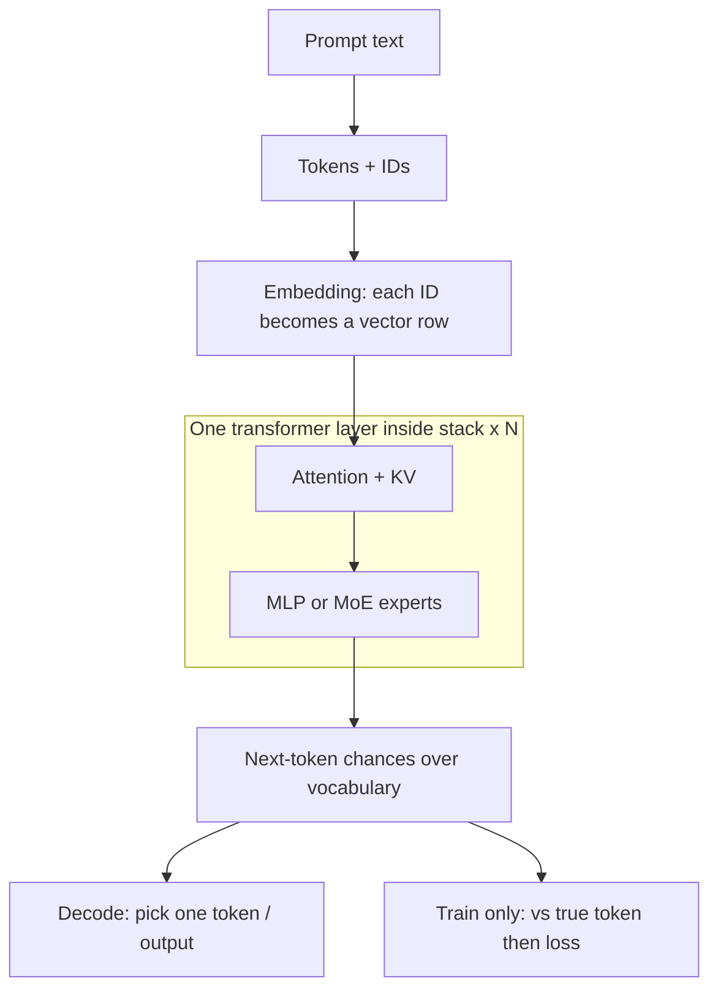
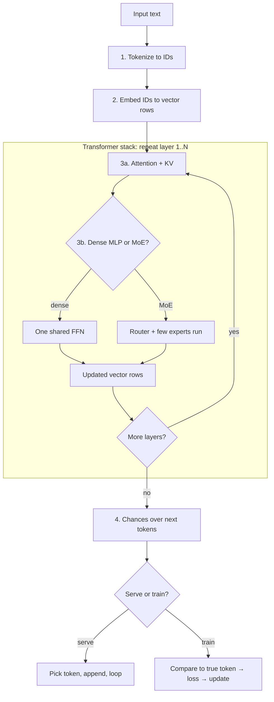

# AI Theory

Primer for how local LLMs work: tokenization, transformers, attention / KV, dense MLP vs MoE, training loss vs inference serving.

Concepts build in order below. Figures use one toy prompt throughout: **The cat sat on the** (illustrative IDs and numbers — not a real model dump).

## Related adventures

| Adventure | What it exercises from this primer |
|-----------|-------------------------------------|
| [AdventuresInAICoding3](https://github.com/Vince-0/AdventuresInAICoding3) | Inference on **fitted** GGUFs; MTP speed (decode path) |
| [AdventuresInAICoding4 - FreeToken](https://github.com/Vince-0/AdventuresInAICoding4) | MoE **expert pool** vs VRAM; KV ↔ cache tradeoffs; serve + agents |

---

## Key Concepts

| Term | Brief explanation |
|------|-------------------|
| **Token / tokenization** | Text split into pieces the model knows (often subwords), each mapped to an integer **token ID** |
| **Embedding** | Lookup that turns each token ID into a **vector** (starting **hidden state** for that token) |
| **Vector / hidden state** | One row of numbers for one token — slots `d0`, `d1`, … up to the model’s hidden size |
| **Dimension (`d0`, `d1`, …)** | A numbered **variable (slot)** in that row |
| **Dimension value** | The decimal in a slot — a **learned value**, not a human-readable score like “32% cat” |
| **Transformer** | Architecture: embed → stack of **transformer layers** → predict next token |
| **Transformer layer** | One repeat of attention + feed-forward (dense MLP or MoE); models stack many layers |
| **Attention** | Lets each position mix information from other tokens (“what context matters?”) |
| **Query / Key / Value** | Internal attention projections; **KV cache** stores past Keys and Values so generation need not recompute the whole prompt every step |
| **KV cache** | Stored Keys/Values from prior tokens during generation; longer context → more memory (often VRAM) |
| **MLP / FFN** | Feed-forward network after attention — transforms each token’s vector on its own |
| **Dense model** | One shared MLP/FFN per layer for every token |
| **MoE** | Mixture of Experts — only a few **experts** run per token; the **full expert pool** still needs storage |
| **Expert** | One MLP/FFN in an MoE bank; **router** picks a few per token |
| **Router (gating)** | Small network that scores experts and selects top-k |
| **Expert pool** | All expert weights across MoE layers — full storage footprint even when few run |
| **Sparse compute** | Only selected experts execute for this token; the rest stay idle |
| **Logits** | Raw scores over the vocabulary for “what token comes next?” (before turning into chances) |
| **Probability / chance** | After softmax, each vocab token gets a chance from 0 to 1; chances across the vocab sum to about 1 |
| **Decoding** | Choosing one next token from that distribution (e.g. highest chance, or sampling) |
| **Inference (serve)** | Forward-only generation — no ground-truth token, no loss step |
| **Training** | Compare prediction to the **true** next token → **loss** → update weights |
| **Loss / error** | Training-only measure of how wrong the predicted chances were vs the actual next token |
| **Detokenize** | Map generated token IDs back to readable text |

---

## Map of the journey

Use these charts for orientation. Worked examples and figures live in the [Walkthrough](#walkthrough).

### One decode step

### Full flow

---

## Walkthrough

Category order: **Tokenize** → **Transformer** → **Predict**. Each step has a short explanation; the figure shows the data operation. Toy numbers only.

### Tokenize

#### 0. Raw input

The model does not start with “understanding.” It starts with characters in a string. Everything later is a transformation of this input (and, when generating, of tokens already produced).

#### 1. Tokenization

A **tokenizer** cuts the string into **tokens** (often subwords) and maps each piece to a **token ID** from a fixed vocabulary. Later stages almost never see raw letters — they see IDs.

#### 2. Embedding

An **embedding** table turns each ID into a **vector**: one row of numbers. Each column heading (`d0`, `d1`, …) is a **variable (slot)**. The decimal in a cell is that variable’s **learned value** for this token — useful to the network, not a readable label like “animal-ness.”

After this step, the prompt is a **sequence of vectors** (one row per token), ready for the transformer stack.

### Transformer

**Step 3 is the transformer**: the same layer recipe repeats many times. Inside each layer you typically get attention, then a feed-forward block (dense MLP **or** MoE).

#### 3a. Attention + KV cache

**Attention** lets positions share information — especially so the latest position can pull context from earlier ones (“what matters for predicting the next token?”).

During generation, **Keys** and **Values** from past tokens are stored in a **KV cache** so the model need not re-encode the whole prompt every step. Longer context means a larger cache (often a VRAM cost).

#### 3b. MoE (Mixture of Experts)

In a **dense** layer, every token runs through one shared feed-forward network. In **MoE**, that slot is a bank of **expert** networks. A **router** selects a few experts for this token (**sparse compute**). The **expert pool** — all experts’ weights — still has to live somewhere (often host RAM), even when most experts are idle for a given step.

### Predict

#### 4. Next-token chances

A final **lm_head** turns the last position’s vector into **logits** (raw scores) over every vocabulary token, then usually **softmax** into **chances** (probabilities) that sum to about 1. **Decoding** picks one token — e.g. the highest chance, or a random sample weighted by chance.

#### Serve (inference)

In serving (chat, FreeToken, llama.cpp, agents), the chosen token is appended and the loop runs again until a stop condition. There is no “correct answer” signal and **no loss / weight update** on this path.

Worked example: [Adventures #4 - Agent harness](https://github.com/Vince-0/AdventuresInAICoding4#agent-harness).

#### Train

Training uses examples with a known next token. The model’s predicted **chances** are compared to that **true** token; the mismatch is **loss**, and backpropagation updates weights so future predictions improve. Serve skips this fork.

### One-line summary

- **Forward:** text → tokens/IDs → vector rows → attention (+ KV) → MLP or MoE → next-token chances → decode.
- **Serve:** append token and loop (no loss).
- **Train:** compare to true next token → loss → update weights.

---

## Sparse compute vs storage

MoE breaks the *compute* side of “everything must fit in VRAM” (few experts active per token) but not the *storage* side — the full **expert pool** is still huge.

Worked example (host-RAM experts + GPU LRU cache on a 10GB card): [Adventures #4 - Why](https://github.com/Vince-0/AdventuresInAICoding4#why) and [Novelty](https://github.com/Vince-0/AdventuresInAICoding4#novelty-vs-the-usual-options).

---

## Dense vs MoE

A checkpoint can be large and still be **dense** (one FFN path, no routed experts). Naming or a support list entry is not the same as MoE architecture.

Worked example (rejected “MoE” that was dense/`fused`): [Adventures #4 - Rejected / failed for the MoE story](https://github.com/Vince-0/AdventuresInAICoding4#rejected--failed-for-the-moe-story).

---

## KV cache and context

During generation the **KV cache** grows with sequence length. On a small GPU, KV and other residents (e.g. a MoE expert cache) often share a fixed memory budget — growing context can force smaller caches and slower decode.

Worked example: [Adventures #4 - Context ↔ MoE cache](https://github.com/Vince-0/AdventuresInAICoding4#context--moe-cache).

---

*Weights, credentials, and machine-specific secrets do not belong in this repo.*
