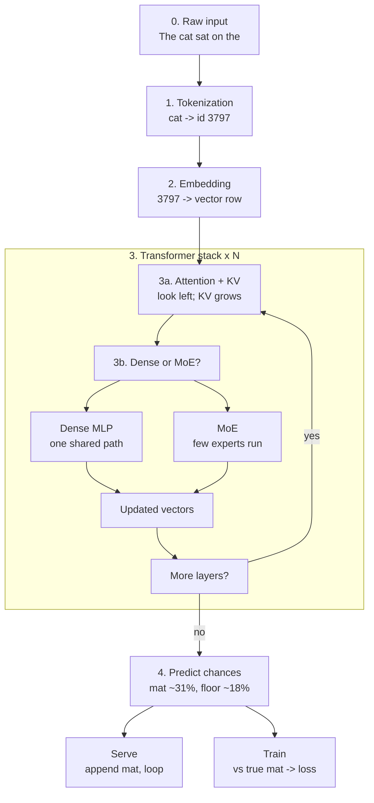
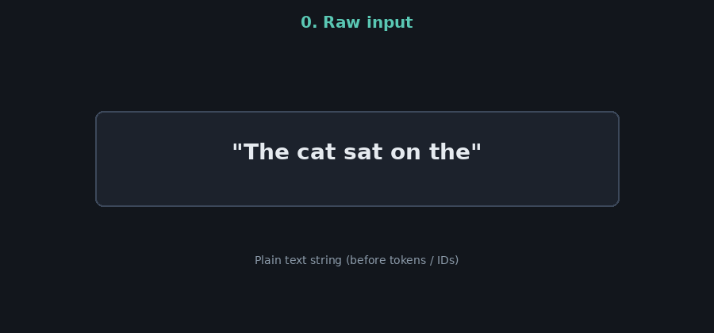
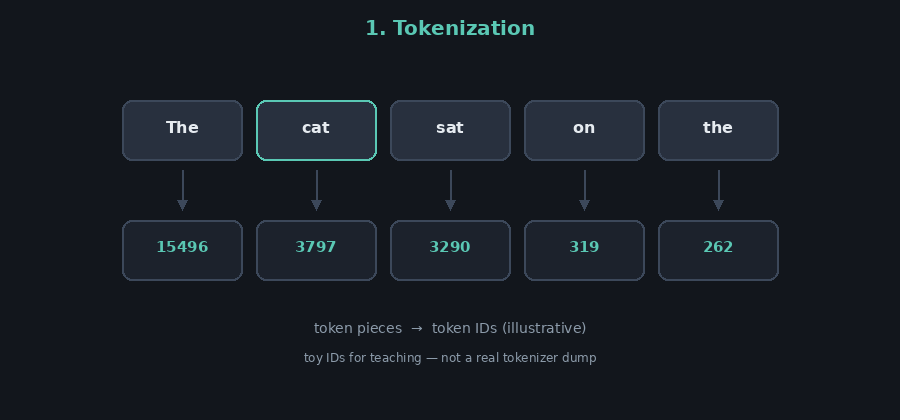
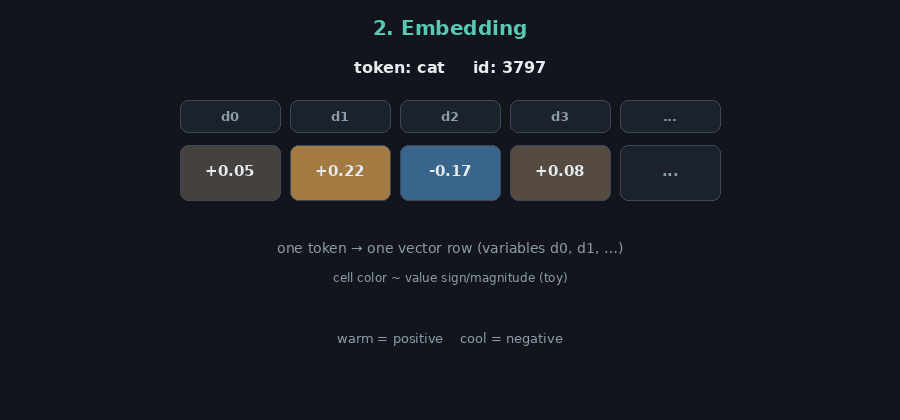
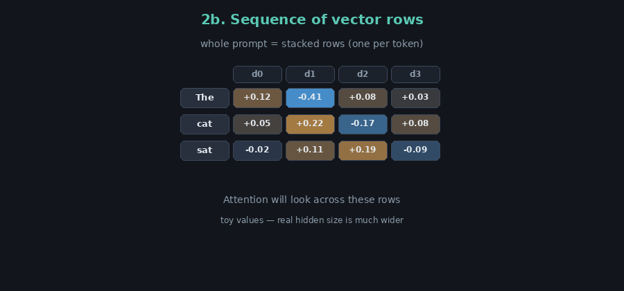
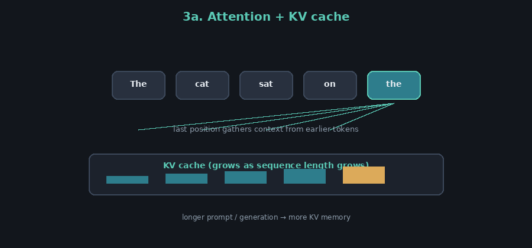
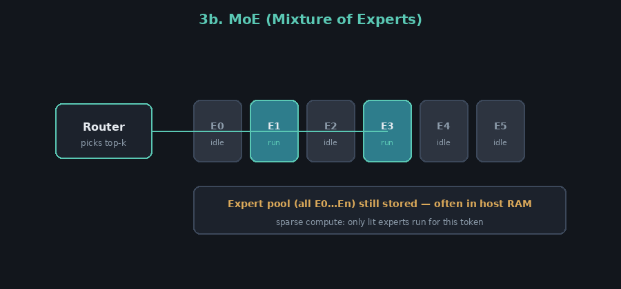
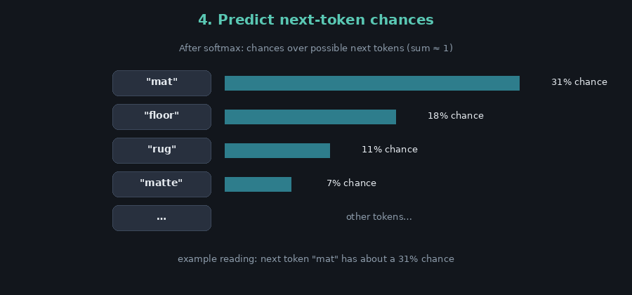
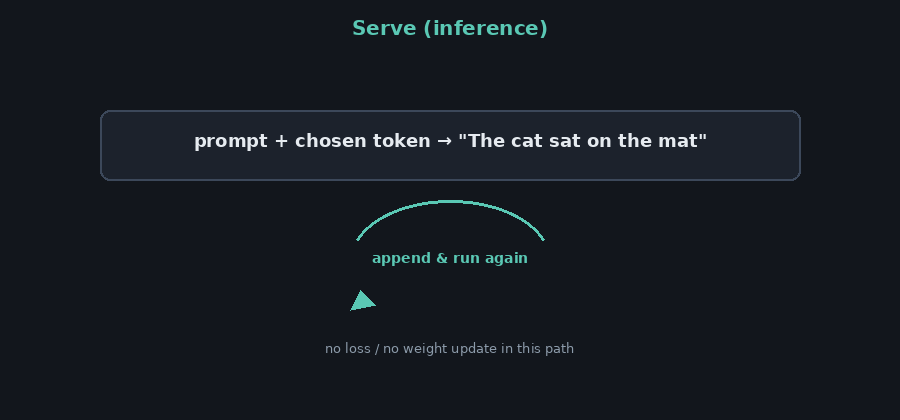
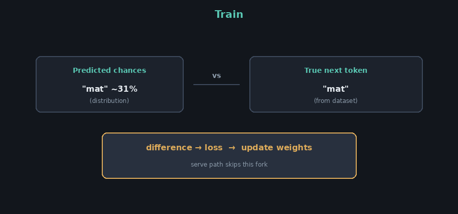

# AI Theory

Primer for how local LLMs work: tokenization, transformers, attention / KV, dense MLP vs MoE, training loss vs inference serving.

Concepts build in order below. Figures use one toy prompt throughout: **The cat sat on the** (illustrative IDs and numbers - not a real model dump).

## Related adventures

| Adventure | What it exercises from this primer |
|-----------|-------------------------------------|
| [AdventuresInAICoding3 - MTP](https://github.com/Vince-0/AdventuresInAICoding3) | Multi-Token-Prediction speed from a GGUFF |
| [AdventuresInAICoding4 - FreeToken](https://github.com/Vince-0/AdventuresInAICoding4) | Run a bigger model with Mixture-of-Experts |

---

## Chat, agents, and invisible stage directions

**ELI5:** The model blurts plausible next words; chat templates and agent harnesses dress those blurts up as a conversation and stuff in invisible stage directions so it stays in character and can use tools.

### The raw model

At heart an LLM is a **next-token guesser**.
Given text so far, it asks: "what token is likely next?"
It is **not** a little person with goals, memory of "this chat," or a built-in duty to be helpful. Training taught it statistical patterns in lots of text - including dialogue - so conversation-*shaped* output is common, but that isn't the same as "logic engine" or "honest assistant."

### The costume: chat / instruct formatting

Products wrap that guesser in a **script**:

- A fixed **system** message ("you are a helpful assistant...")
- **User** / **assistant** turn markers
- Often **safety** and style rules

Those aren't "thoughts." They're **extra tokens prepended or structured around your message** so the model's next-token guesses sound like a polite chat partner. That's the main "meta infrastructure" that makes it **mimic** conversation.

Instruction-tuned / RLHF'd models were further trained to prefer replies that look helpful and on-policy - still next-token prediction, with a stronger bias toward assistant-like behavior.

### What you see vs what the model sees

```text
You type:          "Why is my code slow?"

Model often gets:  [system rules]
                   [tool instructions]
                   [earlier summarized history]
                   [your message]
                   [maybe "use tools like this..."]
```

You only see your line and the reply. The **agent harness** (Hermes, OpenCode, Cursor, etc.) quietly adds:

- Who the assistant is supposed to be
- What tools exist and how to call them
- Scratchpads / plans / memory snippets
- Format rules ("reply with JSON", "don't invent files")

So a lot of "why is it acting logical / careful / agentic?" is **steering text + loops**, not the base model suddenly understanding debate.

### Agent harness in one picture

| Piece | Job |
|--------|-----|
| **LLM** | Propose next tokens (text or "call this tool") |
| **Harness** | Build the hidden prompt, parse tool calls, run tools, append results, ask again |
| **You** | See a tidy conversation |

Multi-step "thinking" is often: harness runs a **loop** - model suggests a step -> tool runs -> result stuffed back into context -> model continues - until the harness stops.

That's why the same weights can feel chatty in a chatbot, coding-agent-ish in OpenCode, and different again with another system prompt - the **invisible wrapper** changed more than the "brain."

---

## Key Concepts

Read top to bottom - each idea builds on the ones above. Where there is a worked example, the term links to that walkthrough step (or to an adventure).

| Term | ELI5 |
|------|------|
| **[Token / tokenization](#walk-tokenize)** | Chop the sentence into little pieces the model knows, and give each piece a number (**token ID**). |
| **[Embedding](#walk-embed)** | Look up that number in a big table and get a row of other numbers for that piece. |
| **Vector / hidden state** | That row of numbers - the model's working description of one token. See [Embedding](#walk-embed) and [stacked rows](#walk-sequence). |
| **Dimension (`d0`, `d1`, ...)** | One labeled slot in the row (like column 0, column 1, ...). |
| **Dimension value** | The decimal sitting in that slot - a learned amount, not a score you can read as "32% cat." |
| **[Layer](#walk-layer)** | One full pass of the same recipe over the token rows: share context, then update each row. Deep models just **repeat** that recipe many times. |
| **[Transformer](#walk-transformer)** | The overall design: embed tokens into rows, run many **layers**, then guess the next token. |
| **Transformer layer** | One copy of that layer recipe: **attention**, then an **MLP** (**multi-layer perceptron**) / **FFN** (**feed-forward network**) or **MoE**. |
| **[Attention](#walk-attention)** | Let tokens "look at" each other so the latest one can borrow useful context from earlier ones. |
| **Query / Key / Value (Q, K, V)** | The three internal notebooks attention uses to decide *who* to look at (**query** vs **keys**) and *what* to copy (**values**). |
| **[KV cache](#walk-attention)** | **Key-Value cache** - saved **key** and **value** notes from tokens already seen, so generation doesn't redo the whole prompt every time. Longer text -> bigger cache. |
| **MLP / FFN** | **Multi-layer perceptron** / **feed-forward network** - after attention, a small network that rewrites **each** token's row on its own (no looking at neighbors). |
| **Dense model** | Every token always uses that **same** one **MLP** / **FFN** path. |
| **[MoE](#walk-moe)** | **Mixture of Experts** - instead of one **MLP**, keep many specialist **MLPs** (**experts**); only a few run for this token. |
| **Expert** | One specialist **MLP** / **FFN** in that **MoE** (**Mixture of Experts**) bank. |
| **Router (gating)** | The chooser that picks which few **experts** get to run. |
| **Expert pool** | **All** the experts' **weights** - still take space even when most are idle. |
| **Sparse compute** | Only the chosen experts do work this step; the others sit out. |
| **[Logits](#walk-predict)** | Raw "how much do I like each possible next token?" scores (not chances yet). |
| **[Probability / chance](#walk-predict)** | Those scores turned into shares from 0 to 1 that add up to about 1 (e.g. `mat` ~31%). |
| **Decoding** | Pick one next token from those chances (often the top one, or a weighted random draw). |
| **[Inference / serve](#walk-serve)** | Run the forward path to generate text - no teacher answer, no grade, no weight update. |
| **[Training](#walk-train)** | Compare the model's chances to the **real** next token, measure the miss, then adjust weights. |
| **Loss / error** | That "how wrong were you?" number used only in training. |
| **Detokenize** | Turn chosen token IDs back into readable words. |

These ideas show up constantly in local LLM adventures ([#3](https://github.com/Vince-0/AdventuresInAICoding3), [#4](https://github.com/Vince-0/AdventuresInAICoding4)).

| Term | ELI5 |
|------|------|
| **Weights** | The huge set of learned numbers inside the model (what training adjusts). |
| **Parameters (e.g. 4B, 8B)** | How many of those weights there are - **B** means **billions**. Bigger often means smarter *and* hungrier for memory. |
| **Quantization** | Store weights with fewer bits so the file and memory use shrink (trade a bit of quality/speed nuance for fit). |
| **Bit depth** | How many bits each weight uses after quantization (e.g. **4-bit** is a common sweet spot; **8-bit** is closer to full quality). |
| **GGUF** | **GPT-Generated Unified Format** - a common packed model file used by **llama.cpp** (and friends). |
| **VRAM** | **Video RAM** - fast memory on the **GPU** (**graphics processing unit**). Dense models usually need weights + **KV cache** to fit here. |
| **Context size** | How many tokens of prompt + reply you can keep in play at once. Bigger context -> more **KV cache** memory. |
| **tok/s** | **Tokens per second** - how fast the server generates (or reads) tokens; the usual speed score for local chat. |
| **Inference server** | The program that loads the model and answers requests (e.g. **llama.cpp** server, **vLLM**, **FreeToken** `ft serve`). |
| **Agent harness** | Software that drives the server through multi-step tool use (e.g. **Hermes**, **OpenCode**) |
| **MTP** | **Multi-token prediction** - draft several tokens per step (speculative decoding) to speed generation on fitted models; |
| **Flash Attention** | A faster way to run the attention math on supported **GPUs** - same idea, less waste. |

---

## Map of the journey

One flowchart for a **decode step**: raw text through the transformer, then the **serve** vs **train** fork. Abbreviated toy data uses the prompt **The cat sat on the**. Figures in the [Walkthrough](#walkthrough) show the same operations in more detail.

### Full flow



---

## Walkthrough

Category order: **Tokenize** -> **Transformer** -> **Predict**. Each step has a short explanation; the figure shows the data operation. Toy numbers only.

### Tokenize

<a id="walk-raw"></a>
#### 0. Raw input

The model does not start with "understanding." It starts with characters in a string. Everything later is a transformation of this input (and, when generating, of tokens already produced).



<a id="walk-tokenize"></a>
#### 1. Tokenization

A **tokenizer** cuts the string into **tokens** (often subwords) and maps each piece to a **token ID** from a fixed vocabulary. Later stages almost never see raw letters - they see IDs.



<a id="walk-embed"></a>
#### 2. Embedding

An **embedding** table turns each ID into a **vector**: one row of numbers. Each column heading (`d0`, `d1`, ...) is a **variable (slot)**. The decimal in a cell is that variable's **learned value** for this token - useful to the network, not a readable label like "animal-ness."

After this step, the prompt is a **sequence of vectors** (one row per token), ready for the transformer stack.



<a id="walk-sequence"></a>
Those rows sit one under another for the whole prompt. Attention's job (next) is to let positions share information **across** that stack.



<a id="walk-transformer"></a>
<a id="walk-layer"></a>
### Transformer

A **layer** is one pass of a fixed recipe over the token rows: **attention** (share context), then a **feed-forward** block (**dense MLP** or **MoE**) that updates each row. A transformer stacks that same layer recipe many times - more layers means more repeats, not a totally different machine each time.

**Step 3 is that stack.** The figures below zoom into what happens *inside* one layer.

<a id="walk-attention"></a>
#### 3a. Attention + KV cache

**Attention** lets positions share information - especially so the latest position can pull context from earlier ones ("what matters for predicting the next token?").

During generation, **Keys** and **Values** from past tokens are stored in a **KV cache** so the model need not re-encode the whole prompt every step. Longer context means a larger cache (often a VRAM cost).



<a id="walk-moe"></a>
#### 3b. MoE (Mixture of Experts)

In a **dense** layer, every token runs through one shared feed-forward network. In **MoE**, that slot is a bank of **expert** networks. A **router** selects a few experts for this token (**sparse compute**). The **expert pool** - all experts' weights - still has to live somewhere (often host RAM), even when most experts are idle for a given step.



### Predict

<a id="walk-predict"></a>
#### 4. Next-token chances

A final **lm_head** turns the last position's vector into **logits** (raw scores) over every vocabulary token, then usually **softmax** into **chances** (probabilities) that sum to about 1. **Decoding** picks one token - e.g. the highest chance, or a random sample weighted by chance.



<a id="walk-serve"></a>
#### Serve (inference)

In serving (chat, FreeToken, llama.cpp, agents), the chosen token is appended and the loop runs again until a stop condition. There is no "correct answer" signal and **no loss / weight update** on this path.

Worked example: [Adventures #4 - Agent harness](https://github.com/Vince-0/AdventuresInAICoding4#agent-harness).



<a id="walk-train"></a>
#### Train

Training uses examples with a known next token. The model's predicted **chances** are compared to that **true** token; the mismatch is **loss**, and backpropagation updates weights so future predictions improve. Serve skips this fork.



### One-line summary

- **Forward:** text -> tokens/IDs -> vector rows -> attention (+ KV) -> MLP or MoE -> next-token chances -> decode.
- **Serve:** append token and loop (no loss).
- **Train:** compare to true next token -> loss -> update weights.

---

## Sparse compute vs storage

MoE breaks the *compute* side of "everything must fit in VRAM" (few experts active per token) but not the *storage* side - the full **expert pool** is still huge.

Worked example (host-RAM experts + GPU LRU cache on a 10GB card): [Adventures #4 - Why](https://github.com/Vince-0/AdventuresInAICoding4#why) and [Novelty](https://github.com/Vince-0/AdventuresInAICoding4#novelty-vs-the-usual-options).

---

## Dense vs MoE

A checkpoint can be large and still be **dense** (one FFN path, no routed experts). Naming or a support list entry is not the same as MoE architecture.

Worked example (rejected "MoE" that was dense/`fused`): [Adventures #4 - Rejected / failed for the MoE story](https://github.com/Vince-0/AdventuresInAICoding4#rejected--failed-for-the-moe-story).

---

## KV cache and context

During generation the **KV cache** grows with sequence length. On a small GPU, KV and other residents (e.g. a MoE expert cache) often share a fixed memory budget - growing context can force smaller caches and slower decode.

Worked example: [Adventures #4 - Context <-> MoE cache](https://github.com/Vince-0/AdventuresInAICoding4#context--moe-cache).

---

*Weights, credentials, and machine-specific secrets do not belong in this repo.*
