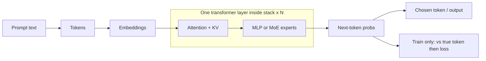
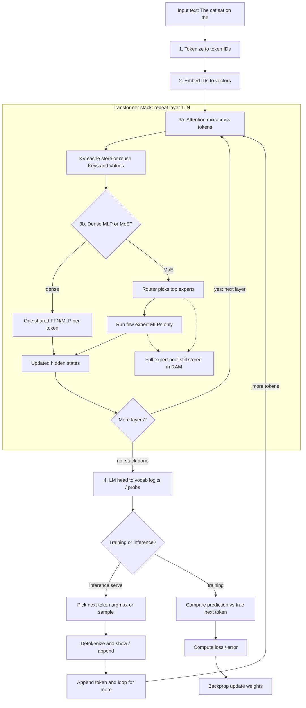
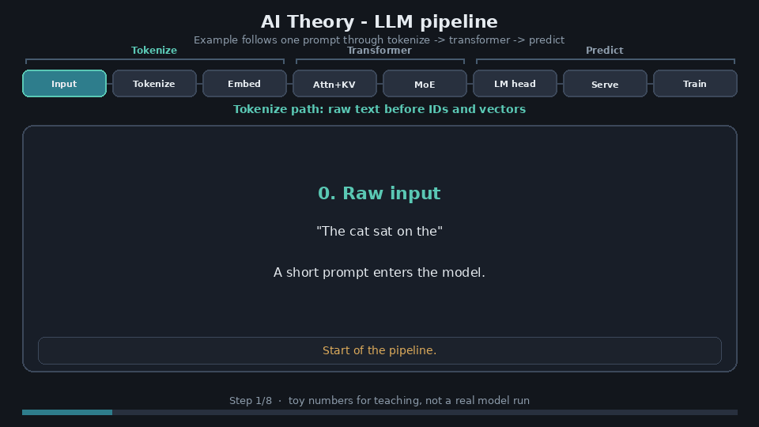

# AI Theory

Primer for how local LLMs work: tokenization, transformers, attention / KV, dense MLP vs MoE, training loss vs inference serving.

## Related adventures

| Adventure | What it exercises from this primer |
|-----------|-------------------------------------|
| [AdventuresInAICoding3](https://github.com/Vince-0/AdventuresInAICoding3) | Inference on **fitted** GGUFs; MTP speed (decode path) |
| [AdventuresInAICoding4 - FreeToken](https://github.com/Vince-0/AdventuresInAICoding4) | MoE **expert pool** vs VRAM; KV ↔ cache tradeoffs; serve + agents |

---

## Key Concepts

| Term | Brief explanation |
|------|-------------------|
| **Tokenization** | Text split into pieces the model knows (often subwords), each mapped to an integer **token ID** |
| **Embedding** | Lookup that turns each token ID into a vector (list of numbers) - the starting **hidden state** |
| **Transformer** | The model architecture: embed → stack of **transformer layers** → predict next token |
| **Transformer layer** | One repeat of attention + feed-forward (dense MLP or MoE); models stack many layers |
| **Attention** | Lets each position mix information from other tokens in the sequence (“what context matters?”) |
| **Query / Key / Value** | Internal attention projections; **KV cache** stores past Keys and Values so generation need not recompute the whole prompt every step |
| **KV cache** | Stored Keys/Values from prior tokens during generation; longer context → more memory (often VRAM) |
| **MLP / FFN** | Multi-Layer Perceptron / feed-forward network after attention - transforms each token on its own (expand → nonlinearity → shrink) |
| **Dense model** | One shared MLP/FFN per layer for every token - all those weights run every step |
| **MoE** | Mixture of Experts - sparse design: only a few **experts** run per token; the **full expert pool** still needs storage |
| **Expert** | One MLP/FFN in an MoE bank - same job as a dense FFN, own weights; router picks a few per token |
| **Router (gating)** | Small network that scores experts and selects top-k for this token |
| **Expert pool** | **All** expert weight tensors across MoE layers - full storage footprint even when only a few experts run |
| **Sparse compute** | Only selected experts execute per token; most of the pool stays idle for that step |
| **Logits / softmax** | Raw vocab scores then probabilities for “what token comes next?” |
| **Decoding** | Choosing a token from that distribution (argmax or sampling) during **inference** |
| **Inference (serve)** | Forward-only generation loop used by local servers / chat - no ground-truth token, no loss step |
| **Training** | Forward pass plus compare to the **true** next token → **loss** → backprop updates weights |
| **Loss / error** | Training-only measure of how wrong the predicted distribution was vs the actual next token (e.g. cross-entropy) |
| **Detokenize** | Map generated token IDs back to readable text |

## One decode step

---

## Full flow

Static Mermaid map of the same story as the [spotlight GIF](#serial-story). Attention, KV, and dense MLP / MoE live **inside** each transformer layer; that layer block repeats N times. Tokenize/embed are before the stack; LM head and train/serve branch are after.

---

## Serial story

Watch one example move through the pipeline (spotlight stages + data card). Toy numbers for teaching - not a real model run.

### 0. Raw input

Example: `The cat sat on the`

### 1. Tokenization

A tokenizer splits text into tokens and maps each to an ID (illustrative, not exact):

`The` `cat` `sat` `on` `the` → `[15496, 3797, 3290, 319, 262]`

### 2. Embedding

Each token ID becomes a vector. The sentence is now a sequence of hidden states.

### 3. Transformer stack (repeat many times)

**Step 3 *is* the transformer** - N identical layers. Inside each layer:

- **3a. Attention (+ KV)** - positions look at each other and mix context. During generation, past **K/V** are cached; longer context → more KV memory.
- **3b. Dense MLP or MoE** - after attention, each token hits a feed-forward block.
  - **Dense:** one shared FFN for every token.
  - **MoE:** a bank of **expert** FFNs + a **router**; only top-k experts run (**sparse compute**), but the **expert pool** still needs a home somewhere (RAM and/or disk) even when VRAM only holds a hot subset.

### 4. Prediction head

A final linear layer (**lm_head**) turns the last hidden state into logits, then usually softmax → a probability distribution over the vocabulary.

### Branch A - Inference (serving)

Pick next token → append → loop until stop. No “actual” next token and no error signal in the loop; quality is judged later (benchmarks, humans).

Worked example: local OpenAI-compatible serve + agent harness in [Adventures #4 - Agent harness](https://github.com/Vince-0/AdventuresInAICoding4#agent-harness).

### Branch B - Training

Compare the predicted distribution to the true next token from the dataset → **loss** → backprop updates weights (embeddings, attention, MLPs/experts, router, …).

### One-line summary

- **Forward:** input → tokens → vectors → attention (+ KV when generating) → MLP or MoE → next-token prediction.
- **Train only:** prediction vs true next token → loss → update weights.
- **Serve only:** prediction → chosen token → stream output.

---

## Sparse compute vs storage

MoE breaks the *compute* side of “everything must fit in VRAM” (few experts active per token) but not the *storage* side - the full **expert pool** is still huge.

Worked example (host-RAM experts + GPU LRU cache on a 10GB card): [Adventures #4 - Why](https://github.com/Vince-0/AdventuresInAICoding4#why) and [Novelty](https://github.com/Vince-0/AdventuresInAICoding4#novelty-vs-the-usual-options).

---

## Dense vs MoE

A checkpoint can be large and still be **dense** (one FFN path, no routed experts). Naming or a support list entry is not the same as MoE architecture.

Worked example (rejected “MoE” that was dense/`fused`): [Adventures #4 - Rejected / failed for the MoE story](https://github.com/Vince-0/AdventuresInAICoding4#rejected--failed-for-the-moe-story).

---

## KV cache and context

During generation the **KV cache** grows with sequence length. On a small GPU, KV and other residents (e.g. a MoE expert cache) often share a fixed memory budget - growing context can force smaller caches and slower decode.

Worked example: [Adventures #4 - Context ↔ MoE cache](https://github.com/Vince-0/AdventuresInAICoding4#context--moe-cache).

---

*Weights, credentials, and machine-specific secrets do not belong in this repo.*
